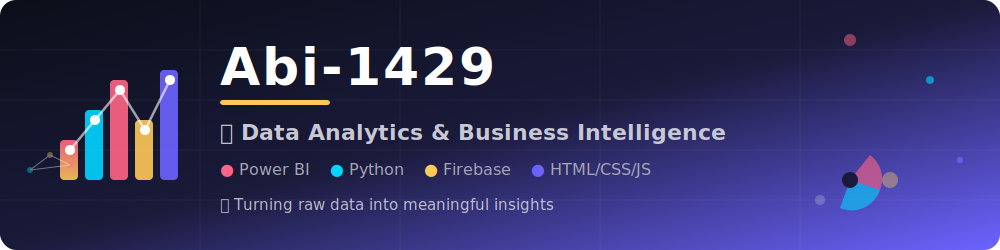

<p align="center">
  
</p>
<div align="center">

# Hi 👋, I'm M ABIRAMI


<br>


<br>


</div>

---

# 💫 About Me

🎓 Passionate about Data Analytics and Business Intelligence

📊 Creating interactive dashboards using Power BI

💻 Building modern web applications

🌱 Constantly learning and improving

🚀 Turning raw data into meaningful insights

---

# 🛠 Tech Stack

<div align="center">


</div>

---

# 📈 GitHub Statistics

<div align="center">


</div>

---

# 🔥 GitHub Streak

<div align="center">


</div>

---

# 📊 Contribution Graph

<div align="center">


</div>

---

# 🏆 GitHub Trophies

<div align="center">


</div>

---

# 🚀 Featured Projects

### 🌐 Virtual Queue Manager

Smart queue management system built using HTML, CSS, JavaScript and Firebase.

### 📊 Sales Performance Dashboard

Interactive Power BI dashboard for analyzing sales and profit trends.

---

# 🌐 Connect With Me

<div align="center">

<a href="https://github.com/Abi-1429">

</a>

<a href="https://linkedin.com/in/YOUR_LINKEDIN">

</a>

<a href="mailto:YOUR_EMAIL">

</a>

</div>

---

# ⚡ Fun Fact

```python
while True:
    learn()
    build()
    improve()
```

---

# 🐍 Contribution Snake

<p align="center">

</p>

---

<div align="center">


### ⭐ Thanks for visiting my profile ⭐

</div>
